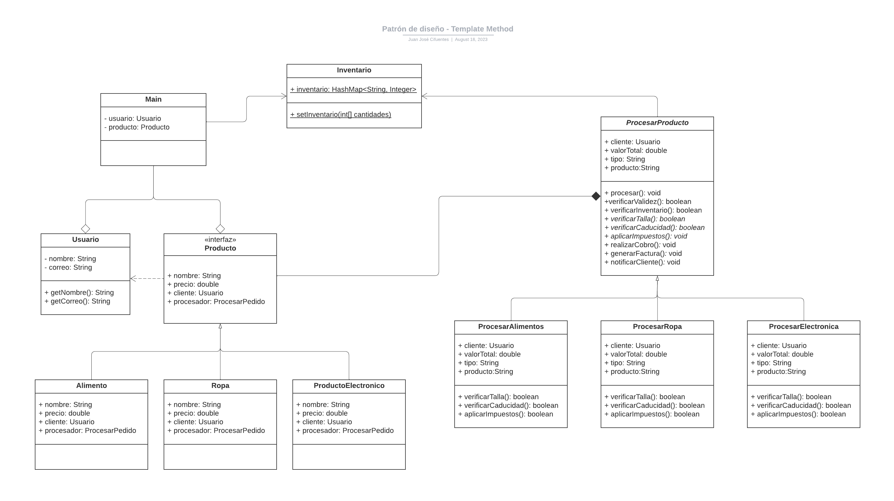
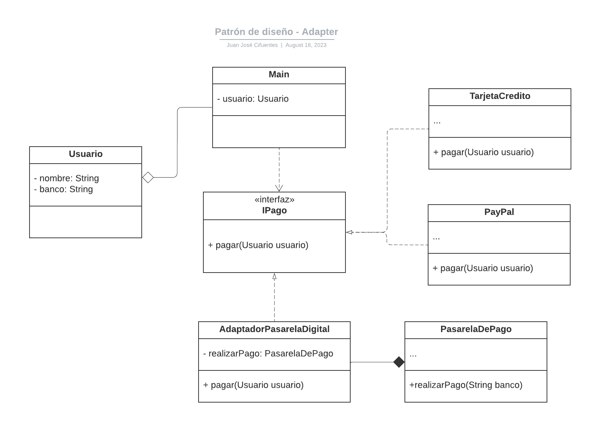
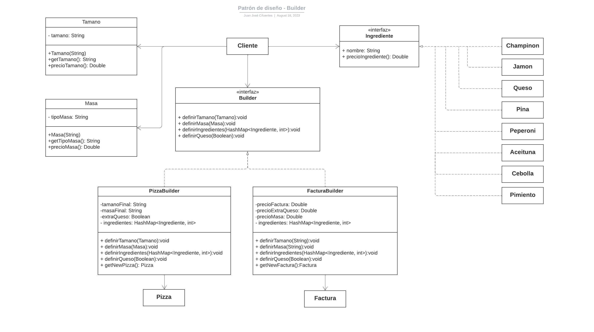

# Integrantes:
- Tomás Candelo Montoya
- Juan José Cifuentes Cuellar
- Gabriel Jiménez Mosquera

# Patrones elegidos:
## Problema #1
Para el primer caso, identificamos que el problema requiere de un **patrón de diseño de comportamiento**,
debido al hecho de que lo que está generando un problema es el procesamiento de los diferentes tipos de
pedido, no su creación ni la forma en la que se relacionan los unos con los otros, por lo que claramente es un 
problema comportamental

El patrón que decidimos implementar finalmente fue el de **Template Method**, debido a que, como bien lo
dice el propio texto, si bien el sistema de procesamiento tiene pasos que pueden ser diferentes, en realidad
pueden reutilizar mucha parte del código, de forma que, en la definición de cada tipo de procesador, solo
tenemos que añadir los "pasos" específicos o diferentes para ese tipo concreto, mientras confiamos el
comportamiento de los pasos generales a una superclase central. Además, este patrón permite que en el
futuro la tienda añada rápidamente nuevos tipos de procesadores sin necesidad de cambiar el código ya 
escrito.

### UML:

## Problema #2
El segundo caso necesita claramente la implementación de un **patrón de diseño estructural**, debido a 
que el problema que presenta es de integración de nuevos componentes en la estructura existente, en
concreto, de un componente cuya interfaz hace imposible su acomplamiento con la estructura del resto
del proyecto.

Para solucionar este problema decidimos implementar el patrón **Adapter**, por motivos evidentes. 
Debido a que no queremos ni podemos cambiar nuestra lógica interna, para que funcione entonces con esta 
nueva interfaz, podemos implementar una clase central que no solo se encargue de operar los métodos de
pago ya implementados, sino que también se encargue de procesar y hacer funcionar la nueva interfaz
sin necesidad de cambiar la lógica.

### UML:

## Problema #3
Para el caso 3 el tipo de patrón de diseño es un **patrón creacional** ya se nos está pidiendo la 
construcción de una orden personalizada de pizza, para este caso el patrón creacional que consideramos 
es el adecuado es **Builder**.

Escogimos este patrón ya que nos permitirá crear objetos que tienen muchos
componentes paso a paso, es decir crea las diferentes características de la pizza por separado para 
luego unir todos esos componentes en el objeto final Pizza, además de que para el caso también se debe 
crear un Objeto factura que entregue al usuario la información de su pedido con los precios de cada 
componente por separado, como este caso no tiene combinaciones predeterminadas sino que es 
completamente personalizable haciendo que sea necesario tener todo por separado para luego unir lo 
que el usuario desee.

### UML:

